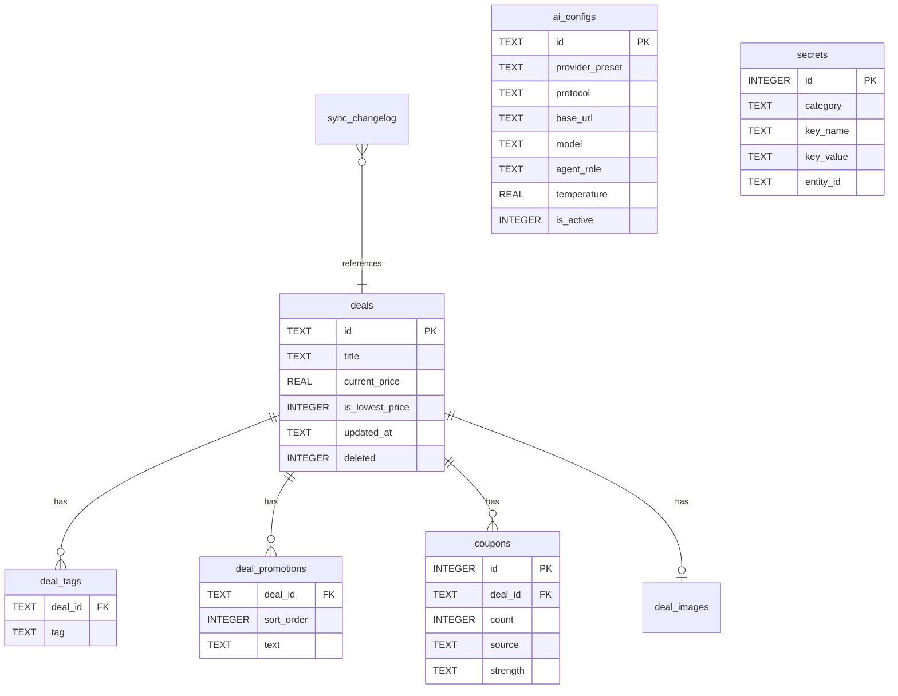

# 折多多 · SQLite 数据库表设计

> 版本：v4.1 | 存储引擎：SQLite 3 | 模式：离线优先 + WebDAV 云同步

---

## 一、设计原则

| 原则 | 说明 |
|------|------|
| 离线优先 | 所有读写走本地 SQLite，无网络亦可完整使用 |
| 图片外置 | 数据库只存 `image_path`，二进制文件在 `images/` 目录 |
| 事务一致 | Deal 主表 + 子表（标签/促销/券）同一事务提交 |
| 可同步 | 每张业务表带 `updated_at` + `revision`，配合 `sync_changelog` 按设备分文件增量上传 |
| 回收站删除 | `deleted` 三态：`0`=正常 / `1`=确认删除 / `2`=待确认删除，避免多端编辑冲突丢数据 |
| 可迁移 | `PRAGMA user_version` 管理 schema 版本 |
| 密钥明文 | 所有密钥密码（API Key、WebDAV 密码等）明文存储在 `secrets` 表，不加密 |

### 本地目录结构

```
{zdd_data_dir}/
├── zheduoduo.db              # SQLite 主库
├── images/
│   ├── {deal_id}.jpg         # 压缩主图
│   └── {deal_id}_thumb.jpg   # 可选缩略图（列表不用，详情/导出用）
├── sync/
│   ├── manifest.json         # 云同步清单（上传用）
│   └── pending/              # 待上传变更包（可选）
└── backups/
    └── backup-20260607.zip   # 手动/自动备份
```

---

## 二、ER 关系



---

## 三、表结构定义

### 3.1 `deals` — 优惠主表

```sql
CREATE TABLE deals (
  id                  TEXT PRIMARY KEY,           -- UUID 或时间戳 ID
  title               TEXT NOT NULL,
  platform            TEXT NOT NULL DEFAULT '其他',
  category            TEXT NOT NULL DEFAULT '其他',
  current_price       REAL NOT NULL,              -- 到手价
  original_price      REAL,
  display_price       REAL,                       -- 页面展示价
  currency            TEXT NOT NULL DEFAULT '¥',
  discount            TEXT,                       -- 如 "6.6折"
  logistics           TEXT,
  link                TEXT,
  note                TEXT,
  visual_type         TEXT NOT NULL DEFAULT 'none' CHECK (visual_type IN ('none','image','ascii')),
  ascii_art           TEXT,
  sales_json          TEXT,                       -- {"sold30Days":">1000"}
  is_lowest_price     INTEGER NOT NULL DEFAULT 0, -- 0=否 1=是，标识当前是否为历史最低价
  created_at          TEXT NOT NULL,              -- ISO8601
  updated_at          TEXT NOT NULL,
  revision            INTEGER NOT NULL DEFAULT 1, -- 每次更新 +1，用于冲突检测
  deleted             INTEGER NOT NULL DEFAULT 0,   -- 0=正常 1=确认删除 2=待确认删除
  deleted_at          TEXT,                        -- 进入 pending_delete 的时间
  device_id           TEXT                         -- 最后修改设备标识
);

CREATE INDEX idx_deals_platform ON deals(platform) WHERE deleted = 0;
CREATE INDEX idx_deals_category ON deals(category) WHERE deleted = 0;
CREATE INDEX idx_deals_created ON deals(created_at DESC) WHERE deleted = 0;
CREATE INDEX idx_deals_price ON deals(current_price) WHERE deleted = 0;
CREATE INDEX idx_deals_updated ON deals(updated_at DESC);
```

### 3.2 `deal_tags` — 标签（多对多展开）

```sql
CREATE TABLE deal_tags (
  deal_id   TEXT NOT NULL REFERENCES deals(id) ON DELETE CASCADE,
  tag       TEXT NOT NULL,
  PRIMARY KEY (deal_id, tag)
);

CREATE INDEX idx_deal_tags_tag ON deal_tags(tag);
```

### 3.3 `deal_promotions` — 促销权益原文

```sql
CREATE TABLE deal_promotions (
  deal_id     TEXT NOT NULL REFERENCES deals(id) ON DELETE CASCADE,
  sort_order  INTEGER NOT NULL DEFAULT 0,
  text        TEXT NOT NULL,
  PRIMARY KEY (deal_id, sort_order)
);
```

### 3.4 `coupons` — 优惠券

```sql
CREATE TABLE coupons (
  id          INTEGER PRIMARY KEY AUTOINCREMENT,
  deal_id     TEXT NOT NULL REFERENCES deals(id) ON DELETE CASCADE,
  sort_order  INTEGER NOT NULL DEFAULT 0,
  count       INTEGER NOT NULL DEFAULT 1,
  source      TEXT NOT NULL DEFAULT '',
  strength    TEXT NOT NULL DEFAULT '',
  note        TEXT
);

CREATE INDEX idx_coupons_deal ON coupons(deal_id);
```

### 3.5 `deal_images` — 图片元数据（一对一）

```sql
CREATE TABLE deal_images (
  deal_id          TEXT PRIMARY KEY REFERENCES deals(id) ON DELETE CASCADE,
  image_path       TEXT NOT NULL,              -- images/{deal_id}.jpg
  thumb_path       TEXT,
  width            INTEGER,
  height           INTEGER,
  quality          INTEGER,                    -- JPEG 质量 0-100
  original_size    INTEGER,                    -- 字节
  compressed_size  INTEGER,
  source_url       TEXT,                       -- YAML image_url 来源
  updated_at       TEXT NOT NULL,
  deleted          INTEGER NOT NULL DEFAULT 0  -- 0=正常, 1=确认删除, 2=待确认删除
);
```

> `visual_type = 'image'` 时应有对应 `deal_images` 记录（`deleted=0`）；切换 `visual_type` 为 `none`/`ascii` 时，`deal_images` 标记为 `deleted=2`（待确认删除）；清理功能删除 `deleted != 0` 的记录及其本地图片文件。

### 3.6 `app_settings` — 应用设置（键值）

```sql
CREATE TABLE app_settings (
  key         TEXT PRIMARY KEY,
  value       TEXT NOT NULL,                   -- JSON 字符串
  updated_at  TEXT NOT NULL
);
```

常用 key 示例：

| key | value 示例 |
|-----|-----------|
| `theme` | `"light"` / `"dark"` |
| `listDisplayMode` | `"normal"` / `"simple"` |
| `filterTimeRange` | `"3m"` |
| `defaultSort` | `"date-desc"` |
| `currency` | `"¥"` |
| `aiProvider` | `"deepseek"` |
| `cloud.webdav.lastSyncAt` | `"2026-06-07T12:00:00Z"` |

> 敏感字段（API Key、WebDAV 密码、云 AK 等）已迁移至 `secrets` 表明文存储。

### 3.7 `sync_meta` — 同步状态（单行）

```sql
CREATE TABLE sync_meta (
  id              INTEGER PRIMARY KEY CHECK (id = 1),  -- 单行
  device_id       TEXT NOT NULL,                       -- 本机 UUID
  local_revision  INTEGER NOT NULL DEFAULT 0,          -- 本地最大 revision
  last_push_at    TEXT,
  last_pull_at    TEXT,
  remote_revision INTEGER DEFAULT 0                    -- 已拉取的远端最大 revision
);
```

> 远端各设备的 revision 从 `manifest.json` 的 `devices` 字段读取，不持久化到本地。

### 3.8 `sync_changelog` — 变更日志（增量同步核心）

```sql
CREATE TABLE sync_changelog (
  id            INTEGER PRIMARY KEY AUTOINCREMENT,
  device_id     TEXT NOT NULL,     -- 产生此变更的设备 UUID，对应远端 changelog_{deviceId}.jsonl
  entity_type   TEXT NOT NULL,     -- deal | deal_image | setting
  entity_id     TEXT NOT NULL,     -- deal_id 或 setting key
  operation     TEXT NOT NULL CHECK (operation IN ('upsert','delete','pending_delete','confirm_delete')),
  revision      INTEGER NOT NULL,
  changed_at    TEXT NOT NULL,
  synced_at     TEXT,              -- NULL = 待上传
  payload_hash  TEXT               -- 可选，校验完整性
);

CREATE INDEX idx_changelog_pending ON sync_changelog(synced_at, device_id) WHERE synced_at IS NULL;
CREATE INDEX idx_changelog_entity ON sync_changelog(entity_type, entity_id);
CREATE INDEX idx_changelog_device ON sync_changelog(device_id, revision);
```

### 3.9 `backup_records` — 备份历史（可选）

```sql
CREATE TABLE backup_records (
  id          INTEGER PRIMARY KEY AUTOINCREMENT,
  file_path   TEXT NOT NULL,
  file_size   INTEGER,
  deal_count  INTEGER,
  created_at  TEXT NOT NULL,
  source      TEXT NOT NULL DEFAULT 'manual'  -- manual | auto | cloud
);
```

### 3.10 `ai_configs` — AI 服务商配置

```sql
CREATE TABLE ai_configs (
  id                TEXT PRIMARY KEY,           -- 配置唯一标识（p_时间戳 或 default）
  provider_preset   TEXT NOT NULL DEFAULT 'DeepSeek',  -- 服务商显示名称
  protocol          TEXT NOT NULL DEFAULT 'openaiChat', -- 协议类型（openaiResponses / openaiChat / anthropic）
  api_key           TEXT NOT NULL DEFAULT '',           -- API Key（已迁移至 secrets 表，列保留兼容）
  base_url          TEXT NOT NULL DEFAULT '',           -- Base URL
  model             TEXT NOT NULL DEFAULT '',           -- 模型名称
  agent_role        TEXT NOT NULL DEFAULT 'default',    -- Agent 角色 ID（default / shopping / yaml）
  agent_prompt      TEXT NOT NULL DEFAULT '',           -- Agent 系统提示词
  temperature       REAL NOT NULL DEFAULT 0.7,         -- 温度参数（0.0 - 2.0）
  max_tokens        INTEGER NOT NULL DEFAULT 4096,     -- 最大输出 token 数
  is_active         INTEGER NOT NULL DEFAULT 0,        -- 是否为当前激活的配置（0/1）
  created_at        TEXT NOT NULL,                     -- ISO8601
  updated_at        TEXT NOT NULL                      -- ISO8601
);

CREATE INDEX idx_ai_configs_active ON ai_configs(is_active) WHERE is_active = 1;
```

> 支持多套 AI 服务商配置，同一时间仅 `is_active = 1` 的一条为当前使用方案。
> 用户可在设置页管理服务商（添加/编辑/删除），内置预设（DeepSeek、硅基流动、OpenAI、Claude）在添加时作为快速填充模板。
> API Key 存储在 `secrets` 表（`category='ai'`, `key_name='api_key'`, `entity_id` 对应配置 ID）。

### 3.11 `secrets` — 密钥密码（明文）

```sql
CREATE TABLE secrets (
  id          INTEGER PRIMARY KEY AUTOINCREMENT,
  category    TEXT NOT NULL,    -- 凭证类别（ai / webdav / cos / oss / other）
  key_name    TEXT NOT NULL,    -- 凭证键名（api_key / password / access_key / secret_key / url / username / path）
  key_value   TEXT NOT NULL,    -- 凭证值（明文存储）
  entity_id   TEXT,             -- 关联实体 ID（如 AI 配置 ID、WebDAV 配置名等，可选）
  note        TEXT,             -- 备注
  created_at  TEXT NOT NULL,    -- ISO8601
  updated_at  TEXT NOT NULL,    -- ISO8601
  UNIQUE(category, key_name, entity_id)
);

CREATE INDEX idx_secrets_category ON secrets(category);
CREATE INDEX idx_secrets_entity ON secrets(entity_id);
```

常用数据示例：

| category | key_name | key_value | entity_id | 说明 |
|----------|----------|-----------|-----------|------|
| `ai` | `api_key` | `sk-xxx` | `default` | AI 服务 API Key（旧单配置模式） |
| `ai` | `api_key` | `sk-xxx` | `p_1718000000000` | 各服务商独立的 API Key |
| `ai` | `prompt_prefix` | `你是一个...` | `default` | 图片解析提示词 |
| `webdav` | `url` | `https://dav.example.com/` | — | WebDAV 地址 |
| `webdav` | `username` | `user@example.com` | — | WebDAV 用户名 |
| `webdav` | `password` | `mysecretpassword` | — | WebDAV 密码 |
| `webdav` | `path` | `/zheduoduo/` | — | WebDAV 同步路径 |
| `cos` | `secret_id` | `AKIDxxx` | — | 腾讯云 SecretId |
| `cos` | `secret_key` | `xxxxx` | — | 腾讯云 SecretKey |
| `oss` | `access_key_id` | `LTAIxxx` | — | 阿里云 AccessKeyId |
| `oss` | `access_key_secret` | `xxxxx` | — | 阿里云 AccessKeySecret |

> **安全说明**：所有密钥密码以明文存储在本地 SQLite 数据库中，不进行加密。此设计基于离线优先原则，避免加密密钥管理复杂度。

### 3.12 Schema 版本

```sql
PRAGMA user_version = 4;
```

升级时递增 `user_version`，在 migration 脚本中执行 `ALTER TABLE` / 新表创建。

| 版本 | 迁移内容 |
|------|----------|
| v1 → v2 | 新增 `ai_configs` 和 `secrets` 表 |
| v2 → v3 | 新增 `prompts` 表 |
| v3 → v4 | `deals` 表新增 `is_lowest_price` 字段（`ALTER TABLE deals ADD COLUMN is_lowest_price INTEGER NOT NULL DEFAULT 0`）|

---

## 四、核心 CRUD 与事务

### 保存一条 Deal（新建/更新）

```sql
BEGIN IMMEDIATE;

-- 1. upsert deals
INSERT INTO deals (...) VALUES (...)
ON CONFLICT(id) DO UPDATE SET ..., revision = revision + 1, updated_at = ?;

-- 2. 子表先删后插
DELETE FROM deal_tags WHERE deal_id = ?;
INSERT INTO deal_tags ...
DELETE FROM deal_promotions WHERE deal_id = ?;
INSERT INTO deal_promotions ...
DELETE FROM coupons WHERE deal_id = ?;
INSERT INTO coupons ...

-- 3. 图片元数据
INSERT OR REPLACE INTO deal_images ...

-- 4. 记录变更日志
INSERT INTO sync_changelog (device_id, entity_type, entity_id, operation, revision, changed_at)
VALUES (?, 'deal', ?, 'upsert', ?, ?);

COMMIT;
```

### 软删除（回收站机制）

```sql
-- 本地删除：进入待确认状态
UPDATE deals SET deleted = 2, deleted_at = ?, updated_at = ?, revision = revision + 1 WHERE id = ?;
INSERT INTO sync_changelog (device_id, entity_type, entity_id, operation, revision, changed_at)
VALUES (?, 'deal', ?, 'pending_delete', ?, ?);

-- 对方确认删除后：标记为已删除
UPDATE deals SET deleted = 1, updated_at = ?, revision = revision + 1 WHERE id = ?;
INSERT INTO sync_changelog (device_id, entity_type, entity_id, operation, revision, changed_at)
VALUES (?, 'deal', ?, 'confirm_delete', ?, ?);

-- 对方取消删除：恢复为正常
UPDATE deals SET deleted = 0, deleted_at = NULL, updated_at = ?, revision = revision + 1 WHERE id = ?;
INSERT INTO sync_changelog (device_id, entity_type, entity_id, operation, revision, changed_at)
VALUES (?, 'deal', ?, 'upsert', ?, ?);
```

### 列表查询（含时间筛选）

```sql
SELECT d.*, GROUP_CONCAT(DISTINCT t.tag) AS tags
FROM deals d
LEFT JOIN deal_tags t ON t.deal_id = d.id
WHERE d.deleted = 0
  AND d.created_at >= ?          -- 时间范围
  AND (? IS NULL OR d.platform = ?)
GROUP BY d.id
ORDER BY d.created_at DESC
LIMIT ? OFFSET ?;
```

### 全文搜索

```sql
SELECT d.* FROM deals d
LEFT JOIN deal_tags t ON t.deal_id = d.id
WHERE d.deleted = 0
  AND (
    d.title LIKE '%' || ? || '%'
    OR d.platform LIKE '%' || ? || '%'
    OR d.category LIKE '%' || ? || '%'
    OR t.tag LIKE '%' || ? || '%'
  )
GROUP BY d.id;
```

正式版可启用 FTS5：

```sql
CREATE VIRTUAL TABLE deals_fts USING fts5(title, note, content='deals', content_rowid='rowid');
```

---

## 五、离线存储流程

```
用户操作 → Repository 层 → SQLite 事务写入
                ↓
         图片压缩 → images/{id}.jpg
                ↓
         sync_changelog 记录待同步项
                ↓
         UI 从 SQLite 读取（内存缓存可选）
```

| 场景 | 行为 |
|------|------|
| 冷启动 | 打开 `zheduoduo.db`，迁移检查，加载列表 |
| 无网络 | 正常 CRUD，changelog 积压本地 |
| 恢复网络 | 若 `autoSync` 开启，后台 push/pull |
| 导入 zip | 解压 → 替换 db + images → 重建索引 |
| 导出 zip | `VACUUM INTO` 或复制 db + 打包 images |

---

## 六、云同步设计（WebDAV）

### 6.1 远端目录

```
remote/zheduoduo/
├── manifest.json                              # 全局版本与文件清单
├── db/
│   ├── changelog_{deviceId_1}.jsonl           # 设备 1 的增量变更
│   ├── changelog_{deviceId_2}.jsonl           # 设备 2 的增量变更
│   └── ...
├── full/                                      # 当前全量（全量 Push 覆盖）
│   ├── zheduoduo.db                           # 最新完整数据库
│   └── manifest.json                          # 全量元信息
├── snapshots/                                 # 历史快照（只增不改）
│   └── zheduoduo-20260607.db.zip
└── images/
    └── {deal_id}.jpg
```

### 6.2 manifest.json

```json
{
  "schemaVersion": 1,
  "remoteRevision": 128,
  "lastModified": "2026-06-07T12:00:00Z",
  "devices": {
    "uuid-device-1": { "lastRevision": 120, "changelogSize": 4096 },
    "uuid-device-2": { "lastRevision": 128, "changelogSize": 2048 }
  },
  "full": {
    "updatedAt": "2026-06-07T12:00:00Z",
    "deviceId": "uuid-device-2",
    "dealCount": 156,
    "dbSize": 327680,
    "imageCount": 89
  },
  "files": {
    "images/xxx.jpg": { "size": 86000, "etag": "..." }
  }
}
```

### 6.3 同步模式总览

| 操作 | 模式 | 触发方式 | 说明 |
|------|------|----------|------|
| Push 增量 | 自动 | 保存后 debounce 3s | 上传变更图片 + changelog 行 |
| Pull 增量 | 自动 | 前台恢复时 | 下载 manifest → 拉取新 changelog → LWW 合并 → 下载缺失图片 |
| **Push 全量** | **手动** | 用户点击"全量上传" | 上传完整 db + 所有图片，覆盖远端，清空 changelog |
| **Download 全量** | **手动** | 用户点击"全量下载" | 下载 full/ 替换本地 db + 图片，重置 revision |
| 冲突 | — | — | `updated_at` 较新者胜；删除进回收站，需对方确认 |

> 全量操作涉及完整数据库和所有图片，文件体积可能较大，**仅支持手动触发**，不设自动。

### 6.4 增量同步流程

**Push 增量**

1. 读取 `sync_changelog WHERE synced_at IS NULL AND device_id = 本机`
2. **先上传关联 `images/{id}.jpg`**（仅新增/变更）
3. 图片上传成功后，将变更序列化为 JSONL 行上传到远端 `changelog_{本机deviceId}.jsonl`
4. 更新 `synced_at`，递增 `sync_meta.local_revision`
5. 更新远端 `manifest.json` 中本设备的 `lastRevision`

> 先图片后 changelog，保证对方 pull 到 deal 数据时图片已在远端。若图片上传失败，changelog 不写入，下次重试。

**Pull 增量**

1. 拉取远端 `manifest.json`，比较各设备 `lastRevision` 与本地 `remote_revision`
2. 下载有更新的设备 changelog 文件（`changelog_{deviceId}.jsonl`）
3. 合并所有设备 changelog，按 `revision` 排序，逐条应用：
   - 按 `entity_type + entity_id` + `updated_at` **Last-Write-Wins**
   - 遇到 `pending_delete` 操作 → 弹窗确认（见冲突策略）
4. 下载缺失图片到本地 `images/`
5. 更新 `sync_meta.last_pull_at`

### 6.5 全量同步流程（手动）

**Push 全量（上传整库 → 覆盖云端）**

适用场景：首次设置云端、换设备后以当前设备为准、手动导入 zip 后同步。

1. 弹窗确认："将覆盖云端所有数据，是否继续？"
2. 本地 `VACUUM INTO` 压缩数据库 → 临时文件
3. 上传压缩 db → `full/zheduoduo.db`
4. 上传本地 `images/*.jpg` → 远端 `images/`（跳过已存在且大小一致的）
5. 写入 `full/manifest.json`（时间、设备、记录数、图片数）
6. 更新远端根 `manifest.json`（remoteRevision、devices、full 字段）
7. 清空远端所有 `changelog_{deviceId}.jsonl`（已合并进全量）
8. 本地 `sync_meta` 重置：`remote_revision = local_revision`
9. （可选）在 `snapshots/` 保留一份快照归档

**Download 全量（下载整库 → 覆盖本地）**

适用场景：新设备首次登录、本地数据库损坏、想以云端为准。

1. 检查本地 `sync_changelog WHERE synced_at IS NULL` 行数
2. 若有未推送记录 → 二次确认："本地有 N 条未同步修改，将被丢弃，是否继续？"
3. 下载 `full/zheduoduo.db` → 替换本地 `zheduoduo.db`
4. 下载 `full/manifest.json` → 读取图片清单
5. 对比本地 `images/` 目录，下载缺失/不同的图片
6. 删除本地多余图片（云端没有的）
7. 重置本地 `sync_meta`：`local_revision = remote_revision`
8. 清空本地 `sync_changelog`（已对齐全量）

**冲突策略**

| 冲突类型 | 策略 |
|----------|------|
| 同 id 两端都修改 | `updated_at` 较新者覆盖；可选弹窗让用户选择 |
| 一端标记 `deleted=2`（待确认），另一端有修改 | 弹窗三选：确认删除 / 取消删除（保留修改）/ 暂不处理 |
| 两端都标记 `deleted=2`（待确认） | 静默确认删除（`deleted = 1`） |
| 图片不一致 | 以 `deal_images.updated_at` 较新者为准 |
| changelog 文件损坏 | 回退下载最近 `snapshots/*.db.zip` 全量恢复 |

**回收站同步流程**

```
设备 A 删除 deal X:
  → deals.deleted = 2, deleted_at = now()
  → sync_changelog 写入 (operation='pending_delete', device_id=A)

设备 B pull 到 pending_delete:
  → 弹窗："deal X 在其他设备被删除，是否确认？"
  → [确认] deals.deleted = 1, sync_changelog 写入 (operation='confirm_delete', device_id=B)
  → [取消] deals.deleted = 0, sync_changelog 写入 (operation='upsert', device_id=B)
  → 下次 push 时 B 的决定同步回 A
```

**自动同步**

- 设置项 `cloud.webdav.autoSync = true`
- 保存 Deal 后 debounce 3s 触发 push
- **App 前台恢复时立即触发 pull**（监听 `visibilitychange` / `appStateChange`）
- 可选定时 pull（如 30min），但以前台恢复为主触发源

### 6.6 COS / OSS

与 WebDAV 共用同一套 `manifest + changelog + images` 逻辑，仅传输层换 SDK：

| 维度 | WebDAV | 腾讯云 COS | 阿里云 OSS |
|------|--------|-----------|-----------|
| 增量 Push/Pull | WebDAV PUT/GET | COS SDK PutObject/GetObject | OSS SDK PutObject/GetObject |
| 全量 Push/Download | 同上（整库+图片） | 同上 | 同上 |
| 目录结构 | `full/` + `changelog_{deviceId}.jsonl` + `images/` | 同左（对象键映射） | 同左 |
| 认证 | 账户+密码 | SecretId + SecretKey | AccessKeyId + AccessKeySecret |
| 密钥存储 | `secrets` 表（明文） | `secrets` 表（明文） | `secrets` 表（明文） |

> 三种传输层共用相同的远端目录结构和同步协议（增量 + 全量），切换提供商时只需更换连接配置，数据格式完全兼容。

---

## 七、与原型字段映射

| 原型 Deal 字段 | SQLite |
|----------------|--------|
| `id` | `deals.id` |
| `title` | `deals.title` |
| `currentPrice` | `deals.current_price` |
| `originalPrice` | `deals.original_price` |
| `currentDisplayPrice` | `deals.display_price` |
| `tags[]` | `deal_tags` |
| `promotions[]` | `deal_promotions` |
| `coupons[]` | `coupons` |
| `visualType` | `deals.visual_type` |
| `image` (base64) | 迁移 → `deal_images.image_path` + 文件 |
| `asciiArt` | `deals.ascii_art` |
| `imageMeta` | `deal_images` 各列 |
| `sales` | `deals.sales_json` |
| `isLowestPrice` | `deals.is_lowest_price` |
| `settings.*` | `app_settings` |
| AI 配置（协议/模型/温度等） | `ai_configs` |
| API Key / WebDAV 密码 | `secrets` |

---

## 八、技术选型建议

| 平台 | SQLite 方案 |
|------|-------------|
| Flutter | `drift` + `sqlite3_flutter_libs` |
| React Native | `op-sqlite` / `react-native-quick-sqlite` |
| Electron | `better-sqlite3` |
| 鸿蒙 | `@ohos.data.relationalStore` 或 SQLite 原生 |

原型阶段可继续 `localStorage`；正式开发第一步实现 `DealRepository` 接口，再切换 SQLite 实现。

---

## 九、相关文档

- [数据持久化方案](./数据持久化方案.md) — 选型结论与同步策略摘要
- [YAML导入格式说明](./YAML导入格式说明.md) — 导入字段与表映射
